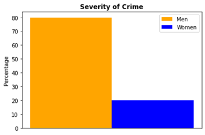
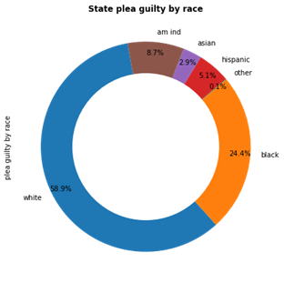
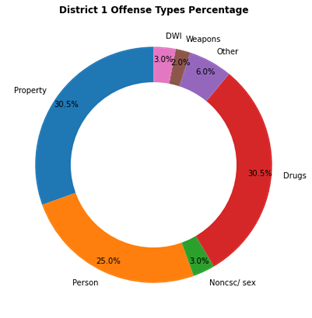
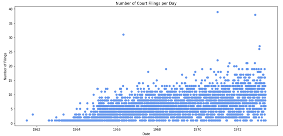

# JUSTFAIR MSU: The Quest for Data
#### By Carlie Couzens (couzens2@msu.edu), Jaclyn Frishcosy (jmfrishcosy@yahoo.com), Alice Krupczak (krupczak@msu.edu), Tyus Walker (walke663@msu.edu)
 
## Abstract
The non-profit organization QSIDE Institute created the JUSTFAIR (Judicial System Transparency for Fairness through Archived/Inferred Records) project for the federal judiciary in 2020. The project seeks to create a database of criminal sentencing decisions and analyze them with respect to patterns in defendant demographics and characteristics of presiding judges. Additionally, the team wants to keep track of patterns of specific judges in the Michigan circuit courts. A team of Michigan State University Data Science majors works alongside QSIDE to apply the original JUSTFAIR project to the state of Michigan. This project seeks to adapt the original JUSTFAIR framework as applied to sentencing outcomes of the Minnesota judicial system by scraping publicly available Michigan judicial data from the Internet. This has proved challenging due to privacy policies, prompting the group to issue a Freedom of Information Act (FOIA) request. A record of the actions taken is provided for future research. 

## Background and Motivation
The project seeks to create a database of criminal sentencing decisions and analyze them with respect to patterns in defendant demographics and characteristics of presiding judges.

For this project, the task was to collect data from judicial decisions across the state of Michigan under the freedom of information act. QSIDE, which stands for Institute for the Quantitative Study of Inclusion, Diversity, and Equity, is the pre-eminent research-into-action network. They apply mathematics, data science, and computation to social justice, finding and securing data that is difficult to aggregate or is intentionally obscured. QSIDE analyzes and models it using cutting-edge techniques and partners with activists to make meaningful change[1]. This data will include demographic information in order to make conclusions about potential bias in decision making. The conclusion hoped for this project is to increase awareness and increase accountability on the judicial system when it comes to sentencing. Looking for bias throughout the state gives insight on areas to improve to make the judicial system equal and fair across the board.

This project is a part of the JUSTFAIR: Judicial System Transparency for Fairness through Archived/Inferred Records, a database of criminal sentencing decisions[2]. QSIDE started phase I of this project, which was compiling data specifically in relation to Federal district courts from public sources, including the United States Sentencing Commission, the Federal Judicial Center, the Public Access to Court Electronic Records system, and Wikipedia. With over 570,000 records from the years 2001 – 2018, JUSTFAIR is the first large scale, free, public database that links information about defendants and their demographic characteristics with information about their crimes, their sentences, and, crucially, the identity of the sentencing judge. Phase II is the extension to the state-level and poses new challenges as instead of working with a single Federal criminal justice system, now be working with 50 different state criminal justice systems. Subtleties vary across states; in particular, some states do not possess state level sentencing guidelines. The state-level data are particularly germane because state judges are often elected officials; creating greater transparency can lead to greater equity and accountability if judges are found to be highly-biased in their sentencing decisions. From the data collected we will be examining sentencing disparities in the judiciary; for example, are there differences in prison terms between BIPOC and white offenders for similar crimes.

## Methodology
The main facet of this project was the collection of data regarding judicial decisions in Michigan. A website from the Michigan Judicial Institute was found[3]. It contained information about over 300,000 Michigan court cases and dated back to 1961. Researchers contacted the website’s administrator explaining the mission of the project in the hopes that access to the website’s database could be shared. The administrator gave a negative response explaining that they did not have the functionality to do so. Since access was not granted to the site’s database, the website’s data was obtained through web scraping instead. 

To obtain the appropriate URL for web scraping, a page’s .json source was navigated to. Each case had an identical URL, with only the case numbers changing. A guess-and-check approach was used to find the first and most recent case numbers. Using a Jupyter Notebook, a loop was created with Python that iterated over the case numbers, retrieved the data, stored it in a Python dictionary, and eventually read it into a .json file. The .json format allows for easy data reading and cleaning.
Upon analysis of the dataset, it was found that the data did not contain the information needed to carry out the JUSTFAIR mission. The website contained only Court of Appeals data, which did not contain information about judicial sentences. It was determined that data from Michigan Circuit Courts would be needed instead.

A traversal of each circuit court’s websites revealed that their format was different from that of the Michigan Judicial Institute. The web scraper previously built would not work for these sites and another method of data retrieval needed to be found.
Researchers reached out to various contacts for advice. Contacted parties include Ingham county prosecutor Carol Siemon, the Michigan Attorney General’s office, and non-profit organizations including Collaboration to End Mass Incarceration, Last Prisoner Project, and the Innocence Project. Those who responded recommended the same thing: to submit a Freedom of Information Act (FOIA) request. A FOIA request was submitted asking for all data regarding sentencing decisions made by Michigan Circuit Courts. A response is pending.

While awaiting the Michigan data, preliminary analysis was done using sentencing decisions made in Minnesota. Visualizations were made using Python’s Matplotlib. 

 
## Results

### Minnesota Data
While web scraping the court of appeals data, Minnesota court sentencing data was analyzed. The hope was that through analyzing this data, the same types of analysis could be applied to the Michigan data once it was obtained. Several conclusions and visualizations were made from this analysis:
  - Person, drugs, and property are the top offense types in district 1.
  - White people are more likely to plead guilty and black is second.
  - Men have a higher crime rate and severity committed
 

 The visual above shows severity of crime from the Minnesota data. You can see that Men have a higher percentage for commiting severe crimes. 

     

 The pie chart above shows data from Minnisota. You can see for plea guilty by race that white makes 58.9 percent. For district 1, property and drugs are the most common offenses. 
The team created two visualizations from the web scraped data.  

### Web scraped data:

  

 The first visualization is a histogram that shows the frequency each type of court is used.

  

 The second visualization that we made is a scatterplot that shows the overall trend or court filings per day.

### Circuit court list
A list of Michigan circuit court websites was compiled into a spreadsheet for future use. If the FOIA request does not contain the complete list of circuit courts, this list will serve as a back-up. These lists could potentially provide the same information that the FOIA would but would need to be web scraped by ~57 individual web scrapers[4].

### People contacted
- John Nevin (Communications director of the MI supreme court)
- Collaboration to End Mass Incarceration 
- The last Prisoner Project
- The Innocence Project and 
- MI Attorney General Office
- Carol Siemon, (County Prosecutor)
- Catherine Grosso (MSU Law Prof.)
- Barbara O’Brian (MSU Law Prof.)

 
### FOIA request Tutorial
A FOIA request tutorial was created with the idea that it could aid students in the future if they are working on similar projects[5].

### FOIA request
A FOIA request was sent on 4/14/2022. A response is anticipated within a week. The data procurement could take upwards of a few months.
 
## Concluding Discussion and Future Work

Although the judicial data proved more difficult to procure than anticipated, the group made strides towards obtaining this court data. A FOIA request was filed to the state of Michigan, and a list of all 57 circuit courts in Michigan and their corresponding websites was compiled. A similar data from Minnesota was explored as well in order to better understand what kinds of visualizations are best, so this work can be applied to the Michigan data once it is in a usable format.

Next steps include, but are not limited to, procuring the data provided by the FOIA request, analyzing the data for links between sentencing lengths and characteristics of the defendant, and web scraping the data from the circuit court websites if needed. An intriguing future project would be extending the JUSTFAIR project to local police departments. The purpose of this would be to examine data for potential biases in policing behavior. More details are included in the Future Works section of the team’s Github repository[5].

 
## Acknowledgements

The QSIDE Institute 

Dr. Jude Higdon-Topaz

Dr. Chad Higdon-Topaz

Dr. Daniel Villalby

Dr. Victor Piercey 

Dr. Dirk Colbry 

Emmett Krupczak 

Linda Frishcosy 

 
## References

1. Our history. QSIDE. (2021, October 31). Retrieved April 29, 2022, from https://qsideinstitute.org/about-us/our-history/ 

2. Ciocanel, M.-V., Topaz, C., Santorella, R., Sen, S., Smith, C., & Hufstetler, A. (2021, October 31). JUSTFAIR: Judicial System transparency for fairness through archived/inferred records. QSIDE. Retrieved April 29, 2022, from https://qsideinstitute.org/research/criminal-justice/justfair/

3. Michigan Judiciary. (n.d.). Courts.michigan.gov. Retrieved April 29, 2022, from https://www.courts.michigan.gov/case-search/ 

4. Couzens, C., Frishcosy, J., Walker, T., Krupczak, A., & Topaz, C. (n.d.). Circuit Court list. Google Sheets. Retrieved April 29, 2022, from https://docs.google.com/spreadsheets/d/1Vs3Pj3WVQdRH9X4VvshVm3c-RnjouO4XJ4Ct-NaBWSk

5. Couzens, C., Walker, T., Frishcosy, J., & Krupczak, A. (n.d.). Carliecouz/justfair-MSU: Collecting judicial information under the Freedom of Information Act; making conclusions about potential biases in decision making. GitHub. Retrieved April 29, 2022, from https://github.com/carliecouz/justfair-msu 

